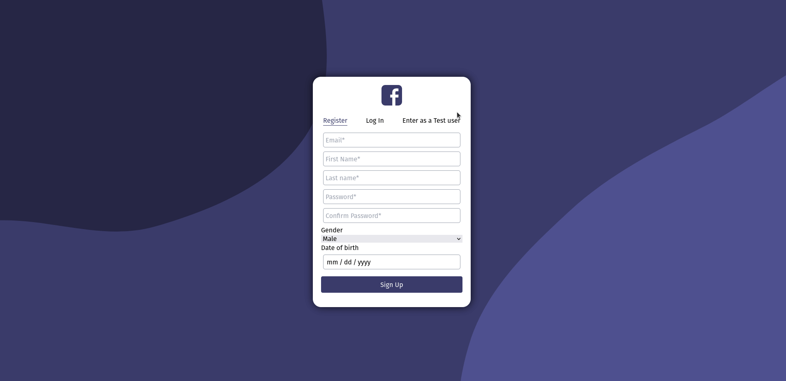

# SOCIAL_MEDIA_TOP     
## Alex Srebernic    

Hello, in this "clone" of Facebook where you can:
- Create a user 
- Edit your profile 
- Add friends
- Chat in real time with your friends 
- Create posts
- Like posts
- Dislike posts 

Currently realtime interaction not working because netlify don't support websockets, but believe me it works. 

[LIVE SERVER](https://condescending-chandrasekhar-2a90a5.netlify.app/)

# Run app locally    

The steps to make this app run locally are these:  

1. Clone,pull or dowload this repository to your PC.
2. Clone the [API](https://github.com/alexsrebernic/API_SM_TOP) repository too
3. Go to app.js in API folder and change io server and headers to http://localhost:your_port
4. Add a link to your MongoDB on the variable process.env.MONGODB_URI
5. Go to this repository folder in the path /pages/_app.jsx change the variable hostSocket to  http://localhost:your_port
6. And finally change all the requests to the API to http://localhost:your_port
